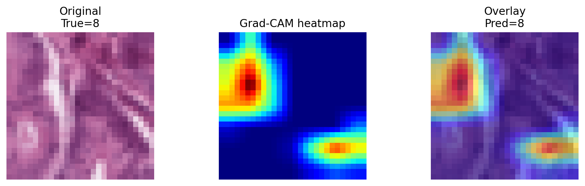
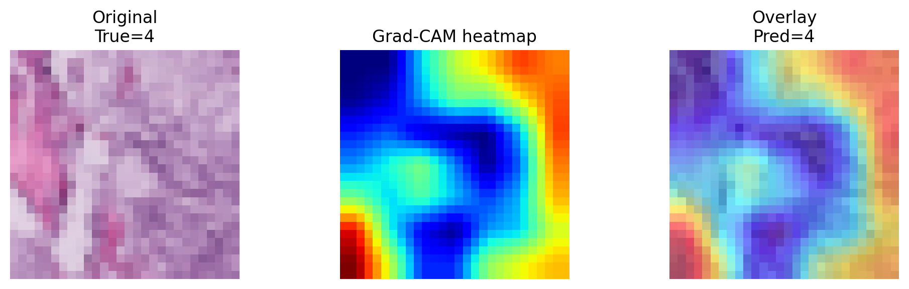
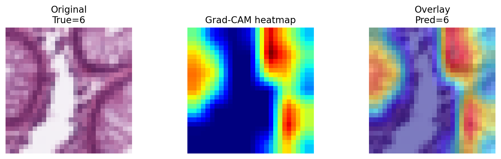
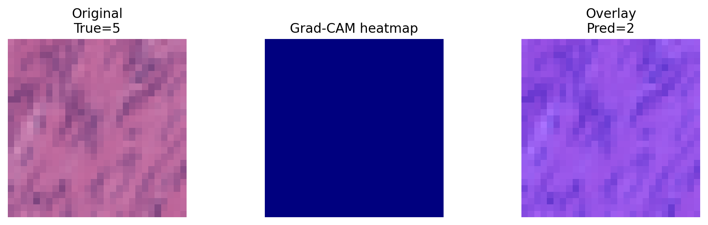
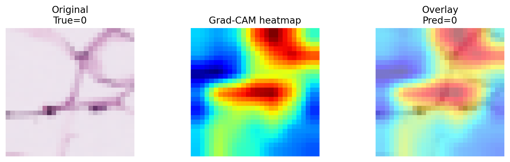

# Explainable AI Report: Convince the Radiologist

## 1. Grad-CAM Explanation

Grad-CAM (Gradient-weighted Class Activation Mapping) is a technique used to visualize which regions of an input image are most important for a convolutional neural network’s prediction. It uses the gradients of a target class flowing into the final convolutional layer to compute importance weights for each feature map. The last convolutional layer is used because it preserves spatial information while capturing high-level semantic features. These weighted feature maps are combined to produce a heatmap that highlights where the model is focusing.

---

## 2. Model Training Results

We trained a simple convolutional neural network on the PathMNIST dataset for 7 epochs.

* Final Test Accuracy: **0.7994 (79.94%)**

This exceeds the required threshold of 70%, indicating that the model successfully learned useful patterns from the dataset.

---

## 3. Grad-CAM Visualization Results

### Example 1 — Sensible Attention (True = 8, Pred = 8)

In this example, the model correctly predicts the class and focuses on regions with clear tissue structure rather than background areas.

**Interpretation:**
The model appears to rely on meaningful histological features, such as texture and structural variation.

---

### Example 2 — Suspicious Attention (True = 4, Pred = 4)

The heatmap shows a coarse, grid-like pattern that does not align well with actual tissue structures.

**Interpretation:**
This suggests that the model may be influenced by low-level patterns or architectural artifacts instead of true biological features.

---

### Example 3 — Border-Focused Attention (True = 6, Pred = 6)

The model places strong attention near image borders rather than central tissue regions.

**Interpretation:**
This indicates a potential reliance on boundary artifacts, which is a sign of shortcut learning.

---

### Example 4 — Model Failure (True = 5, Pred = 2)

The model makes an incorrect prediction and the heatmap is nearly empty.

**Interpretation:**
The model fails to identify meaningful features, leading to incorrect classification.

---

### Additional Example (True = 0, Pred = 0)

This case shows moderate localization but the alignment with anatomical structures is unclear.

---

## 4. Discussion: Is the Model Trustworthy?

The Grad-CAM visualizations show that the model behaves inconsistently.

In some cases, the model focuses on relevant tissue regions, suggesting that it has learned meaningful features. However, in other cases, it relies on image borders, produces grid-like patterns, or fails to highlight any region at all. These behaviors indicate that the model may be exploiting dataset artifacts or unstable representations.

Therefore, while the model achieves good classification accuracy, its decision-making process is not fully reliable.

---

## 5. Final Verdict

**Needs more validation**

Although the model performs well quantitatively, the explainability analysis reveals inconsistent and sometimes suspicious attention patterns. Therefore, it cannot yet be trusted in a clinical setting without further validation.
